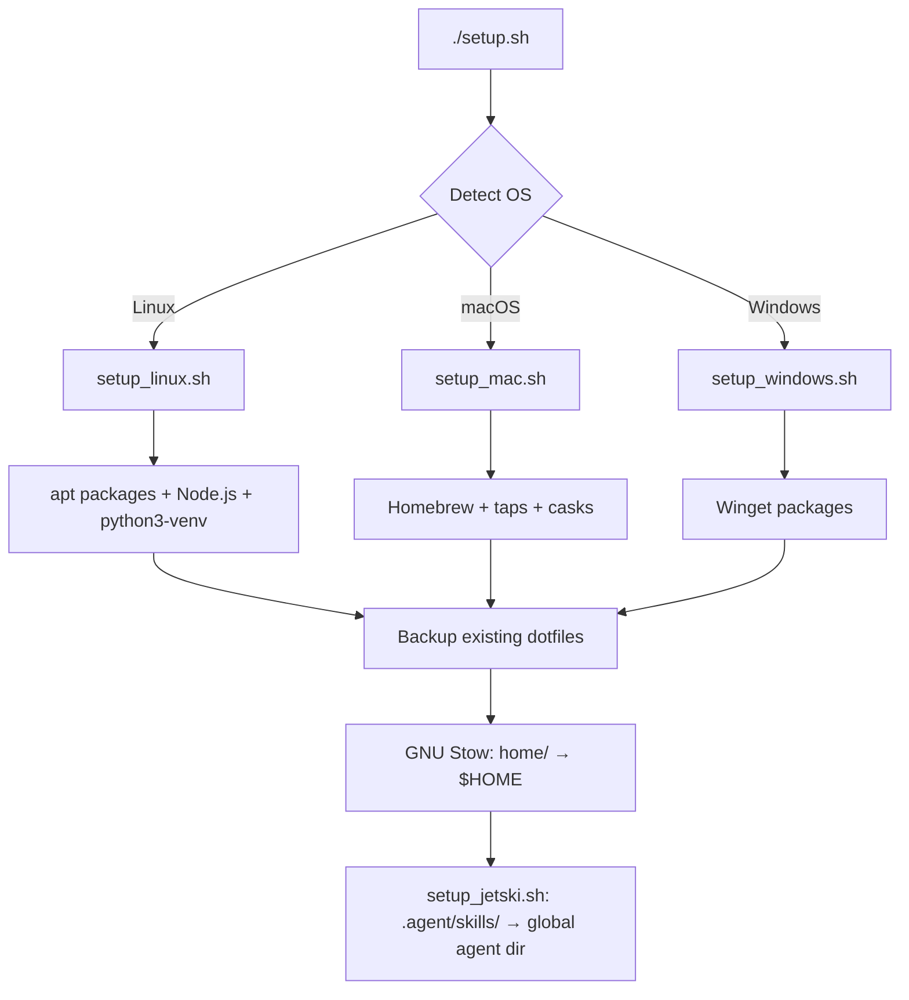

# Developer Documentation

Internal architecture, dependency management, and extension guide for `workspace_setup`.

> **Audience**: contributors and maintainers. For setup and daily use, see [README.md](README.md).

---

## Architecture Overview

The system is cross-platform: Linux (Debian/Fedora/Arch), macOS (Intel/Apple Silicon), and Windows (Git Bash + Winget).

### Execution Flow



### Core Components

| File / Directory | Purpose |
|---|---|
| `setup.sh` | Entry point — OS detection, backup, global stow, delegates to OS scripts |
| `setup_linux.sh` | apt packages, Node.js, `python3-pip`, `python3-venv` |
| `setup_mac.sh` | Homebrew, taps, casks; cryptographically validates installer |
| `setup_windows.sh` | Winget packages for Git Bash environments |
| `home/` | Source of truth for all dotfiles — stowed to `$HOME` |
| `versions.json` | Pinned dependency versions (all platforms) |
| `setup_jetski.sh` | Copies `.agent/skills/` into `~/.gemini/antigravity/skills/` for the agent runtime |
| `sync_skills.sh` | Reverse sync: copies skill changes from the global agent dir back into the repo for committing |
| `cleanup_backups.sh` | Removes old `~/.dotfiles_backup.*` directories |

---

## Dependency Management & Pinning

`versions.json` locks package versions to prevent "works on my machine" drift.

### Updating Pins

| Platform | Command |
|---|---|
| Linux (apt) | `./update_linux_pins.sh` |
| macOS (Homebrew) | `./update_homebrew_pin.sh` _(cryptographically validates installer)_ |
| Windows (winget) | `./update_windows_pins.sh` |

---

## Agent Skills

Custom AI agent skills live in `.agent/skills/`. The only skill currently in the repo is `principal_engineer`.

> [!WARNING]
> **Do NOT symlink agent skills.** The agent runtime prohibits symlinks for security sandboxing. Always use the copy-based scripts below.

### Workflow

```
Repo (.agent/skills/)  ←──sync_skills.sh──  Global dir (~/.gemini/antigravity/skills/)
                        ──setup_jetski.sh──→
```

- **Deploy to agent**: `./setup_jetski.sh` (run after cloning or after editing skills in the repo)
- **Save changes back**: `./sync_skills.sh` (run after editing skills via the agent, then commit)

### Skill Structure

Each skill is a directory under `.agent/skills/<skill_name>/`:

```
principal_engineer/
├── SKILL.md              # Protocol document injected as agent system prompt
├── docs/
│   ├── MANIFEST_TEMPLATE.md   # Template for creating project_manifest.md
│   ├── HANDOFF_PROTOCOL.md    # Context-window handoff procedure
│   ├── RECOVERY_GUIDE.md      # Subagent stall + failure recovery
│   └── manifest_schema.json   # JSON Schema for manifest validation
└── tests/
    ├── run_tests.py           # LLM behavioral test runner
    ├── README.md              # Test setup and scenario table
    └── scenarios/             # 12 JSON scenario files
```

### Running Skill Tests

Tests verify that a weaker LLM correctly follows the `SKILL.md` protocol.

```bash
# Requires the agent venv (created by setup scripts)
export GEMINI_API_KEY="your-key-here"

# Run all 12 behavioral scenarios
~/.agent-venv/bin/python3 .agent/skills/principal_engineer/tests/run_tests.py

# Run a single scenario
~/.agent-venv/bin/python3 .agent/skills/principal_engineer/tests/run_tests.py --scenario 01_turn_start

# Verbose output (shows full model responses)
~/.agent-venv/bin/python3 .agent/skills/principal_engineer/tests/run_tests.py --verbose
```

> Estimated cost: ~$0.01–$0.02 per full 12-scenario run at pay-as-you-go Gemini API rates. The free tier (rate-limited) is sufficient for development use.

---

## Troubleshooting

### Failed Package Installation

- **Linux**: Ensure your user has passwordless `sudo` if running non-interactively. On Ubuntu 24.04+, `pip install` without a venv will fail due to PEP 668 — use the `~/.agent-venv` created by setup scripts.
- **macOS**: If Homebrew fails, verify internet access and that Xcode Command Line Tools are installed (`xcode-select --install`).
- **Windows**: Ensure `winget.exe` is up to date. First-run source agreements may need manual acceptance if `--accept-source-agreements` fails.

### Dotfile Collisions

If `setup.sh` finds a real file where it wants to create a symlink, it automatically moves the existing file to `~/.dotfiles_backup.YYYYMMDD_HHMMSS`. Clean these up with:

```bash
./cleanup_backups.sh
```

### Stow Not Found

`setup.sh` falls back to `ln -snf` when Stow is unavailable (common on Windows). Stow is preferred because it tracks ownership and handles directory tree merging; the `ln` fallback is intentional for Windows.

### Agent Skills Not Loading

1. Verify `setup_jetski.sh` completed without errors.
2. Check that `~/.gemini/antigravity/skills/principal_engineer/SKILL.md` exists.
3. If you edited skills in the global dir but forgot to sync, run `./sync_skills.sh` then commit.
