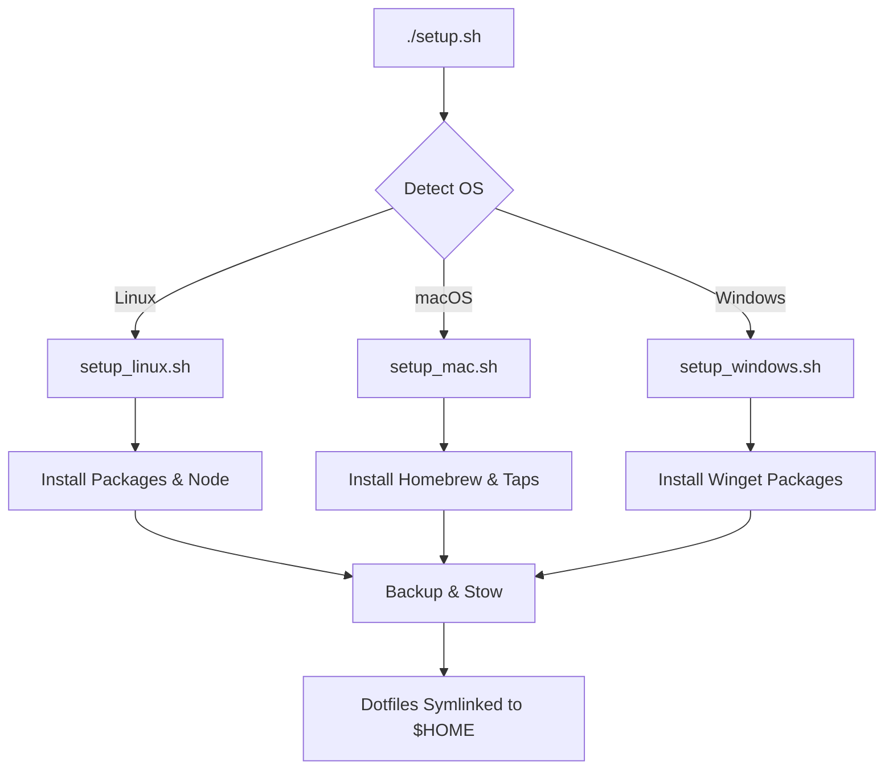

# Developer Documentation

Welcome to the `workspace_setup` development guide. This document explains the internal architecture, dependency management, and how to extend this system.

## Architecture Overview

The system is designed to be cross-platform, supporting Linux (Debian, Fedora, Arch), macOS (Intel/Apple Silicon), and Windows (Git Bash + Winget).

### Execution Flow

The following diagram illustrates how the `setup.sh` entry point delegates work to OS-specific drivers and then performs the final dotfile deployment.

### Core Components

1.  **`setup.sh`**: The main entry point. Handles OS detection, pre-installation backups, and global dotfile symlinking using GNU Stow (or `ln` fallback).
2.  **OS Scripts**: Specialized scripts for each operating system that handle package manager abstractions and runtime installations (Node.js, etc.).
3.  **`home/` Directory**: Contains the "source of truth" for all dotfiles. GNU Stow maps this entire directory to `~`.
4.  **`versions.json`**: A unified registry for dependency pinning, ensuring reproducible environments across all platforms.
5.  **`setup_jetski.sh`**: Configures the local agent (Antigravity/Jetski) environment to use the custom developer skills stored in the repo.

## Dependency Management & Pinning

To prevent "it works on my machine" issues, we use `versions.json` to lock package versions where possible.

### Updating Pins

Run the following scripts to refresh the versions in `versions.json`:
- **Linux (apt)**: `./update_linux_pins.sh`
- **Windows (winget)**: `./update_windows_pins.sh`
- **macOS (homebrew)**: `./update_homebrew_pin.sh` (Cryptographically validates the installer).

## Agent Skills & Synchronization

We include custom "Agent Skills" (located in `.agent/skills`). These are synchronized to the global agent directory (`~/.gemini/antigravity/skills`).

> [!WARNING]
> **Do NOT use symlinks for agent skills.** The agent runtime environment prohibits symlinks for security sandboxing. Use `sync_skills.sh` to port changes from your active global environment back into the repository for committing.

## Troubleshooting

### Failed Package Installation
- **Linux**: Ensure your user has `sudo` privileges without a password prompt if running in a non-interactive CI environment.
- **Windows**: Check that `winget.exe` is updated. Sometimes first-run agreements need to be accepted manually if the `--accept-source-agreements` flag fails.
- **macOS**: If Homebrew installation fails, verify your internet connection and ensure Xcode Command Line Tools are installed (`xcode-select --install`).

### Dotfile Collisions
If `setup.sh` detects a real file where it wants to create a symlink, it will automatically move the existing file to `~/.dotfiles_backup.YYYYMMDD_HHMMSS`. You can clean these up using `./cleanup_backups.sh`.

### Stow Command Not Found
The `setup.sh` script includes a fallback provided by `ln -snf`. However, `stow` is preferred for its ability to track ownership and handle directory tree merging. On Windows, `stow` is usually unavailable; the fallback is the intended path.
